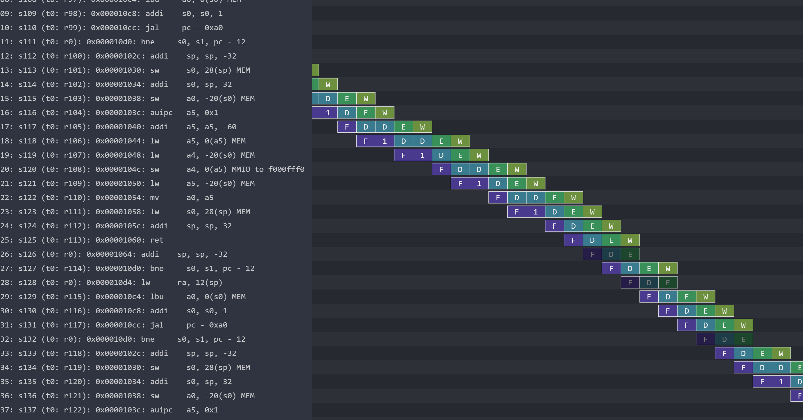

# rec04

This week we will be taking a break from Fibonacci and instead go through my personal emporium of [Konata](https://github.com/shioyadan/Konata) pipeline visualization logs. These logs will cover several stages of pipelining your processor and will provide a visual aid to seeing what the lab requires.

I will also discuss some details about the processor that you may find helpful as you continue working on the lab, and I will answer student questions :)

- Why Konata logs for better debug statements in processors.
- Bisection strategy to find bugs
- FIFOs as our bread and butter
- Brief note on scheduling (CF, combinational path, etc.)
- [Bluespec VS Code Extension](https://marketplace.visualstudio.com/items?itemName=MartinChan.bluespec) (disclosure: I made it)
- Reassurance on the current lab.
- Teaser on the next lab.

In this repo are the logs which you may look at on your own machine's installation of Konata. All of them are an execution of `thelie32`. The number in the name denotes how many concurrent stages we can have in one cycle.

- `1_boring` is the plain multicycle log.
- `2_concurrent_alwaysF` is when we permit fetch to always fire, along with one of D/E/W.
- `3_concurrent_DW` is when we permit F and E to always fire, but D/W need to take turns.
- `4_concurrent` logs are when we have four concurrent stages, with some variation between two different implementations of the redirect. One requires an additional cycle to redirect, and the other is bypassed. (at what cost?)
- `funky` is a funky looking log from an almost-correct implementation of a four concurrent stage processor.
- `funky_fixed` is when we switch two method calls in `funky`. It has the best cycles-per-instruction (at what cost? compare with `4_concurrent`)

Here is a picture of what `funky_fixed` looks like (and what your processor may look like when you're done!) in case you haven't opened Konata yet.

Tip on working on the lab: focus on correctness with concurrency ("What is the minimum it would take (within reason) for these two stages to fire in the same cycle and maintain correctness?") , then look at optimizations like bypasses only if you have time left over. You will see as soon as the cache lab that your performance bottleneck will be cache misses.